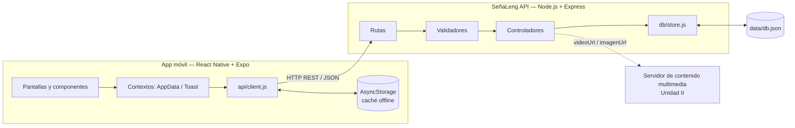
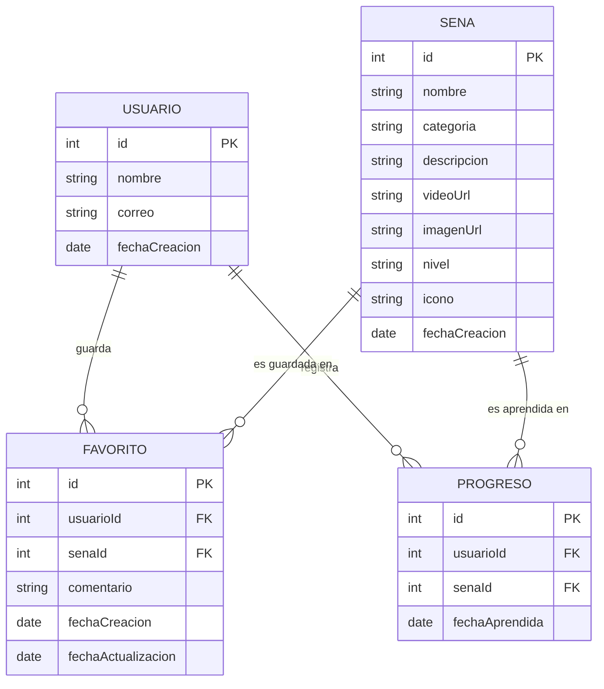

# Arquitectura — SeñaLeng

## 1. Vista general (cliente-servidor de tres capas, sección 10.1)



| Componente del documento | Implementación |
|---|---|
| Aplicación móvil | `app/` — React Native 0.86 + Expo SDK 57, React Navigation 7 |
| API (REST/JSON) | `api/` — Express 4 con formato de respuesta estandarizado |
| Base de datos | `api/data/db.json` a través de `db/store.js` (capa intercambiable) |
| Almacenamiento local | AsyncStorage: caché de GET + URL de la API configurada |
| Servidor multimedia | Campos `videoUrl` / `imagenUrl` listos; el contenido se hospedará en la Unidad II |

## 2. API — organización por capas

```
api/
├── src/
│   ├── server.js              Arranque, muestra URLs local y de red
│   ├── app.js                 Express: CORS, JSON, logs, Swagger, rutas, errores
│   ├── config/index.js        Puerto, host, archivo de datos, usuario por defecto
│   ├── routes/                Definición de endpoints (senas, favoritos, usuarios, categorias)
│   ├── middlewares/           validateId, notFound, errorHandler
│   ├── validators/            Reglas de negocio de cada entidad
│   ├── controllers/           Lógica de cada operación CRUD
│   ├── db/store.js            Persistencia (all, findById, insert, update, remove...)
│   ├── db/seed.js             Datos iniciales
│   ├── docs/openapi.js        Especificación OpenAPI 3.0
│   └── utils/                 Respuestas estándar, normalización de texto
└── tests/api.test.js          22 pruebas de integración
```

Flujo de una petición:

```
POST /api/favoritos
  → express.json()             (JSON mal formado → 400)
  → routes/favoritos.routes    
  → controllers.create
      → validateFavorito()     (datos inválidos → 400)
      → ¿existe usuario/seña?  (→ 404)
      → ¿ya es favorito?       (→ 409)
      → store.insert()         (escritura atómica en db.json)
  → 201 { success: true, data }
  (cualquier excepción → errorHandler → { success: false, error })
```

**¿Por qué un archivo JSON?** Para que el proyecto corra en cualquier PC del equipo sin instalar un motor de base de datos. Todos los controladores usan solo las funciones de `db/store.js`; en la Unidad II basta con reimplementar ese módulo con Prisma/Sequelize.

## 3. Modelo de datos



Reglas: (usuarioId, senaId) es único en FAVORITO y en PROGRESO; (nombre, categoria) es único en SENA; al eliminar una seña se eliminan en cascada sus favoritos y progreso.

## 4. App — estructura

```
app/
├── App.js                      Splash → proveedores de contexto → navegación
├── app.json                    Nombre, ícono, splash, permisos HTTP en desarrollo
├── assets/                     Logo del equipo convertido a ícono, adaptive icon, favicon
└── src/
    ├── config.js               Detección automática de la URL de la API
    ├── theme.js                Colores, radios, sombras, tipografía (del wireframe)
    ├── api/client.js           fetch + timeout + errores + caché offline + funciones CRUD
    ├── context/AppDataContext  Favoritos y progreso compartidos entre pantallas
    ├── context/ToastContext    Avisos flotantes
    ├── hooks/useSenas.js       Búsqueda con debounce y categorías
    ├── navigation/             Stack raíz + pestañas inferiores
    ├── components/             SenaRow, SearchBar, Chips, Thumb, BottomSheet, ConfirmDeleteSheet,
    │                           CommentSheet, Button, IconButton, BackHeader, ScreenHeader, StateView
    └── screens/                Splash, Home, SenasList, SenaDetail, Favoritos,
                                AgregarFavoritos, SenaForm, Perfil
```

### Navegación

```
Stack raíz
├── Main  (pestañas)
│   ├── Inicio      HomeScreen
│   ├── Señas       SenasListScreen
│   ├── Favoritos   FavoritosScreen
│   └── Perfil      PerfilScreen
├── Detalle            SenaDetailScreen
├── AgregarFavoritos   AgregarFavoritosScreen (modal)
└── SenaForm           SenaFormScreen (crear / editar)
```

### Pantallas ↔ wireframes ↔ API

| Wireframe | Pantalla | Llamadas a la API |
|---|---|---|
| Fig. 2 Splash | `SplashScreen` | — |
| Fig. 3 Inicio | `HomeScreen` | `GET /categorias`, `GET /usuarios/1/progreso` |
| Fig. 4 Listado | `SenasListScreen` | `GET /senas?q=&categoria=` |
| Fig. 5 Detalle | `SenaDetailScreen` | `GET /senas/:id`, `GET /senas/:id/relacionadas`, `POST/DELETE /favoritos`, `POST/DELETE /usuarios/1/progreso` |
| Fig. 6 Eliminar favorito | `ConfirmDeleteSheet` | `DELETE /favoritos/:id` |
| Fig. 7 Añadir favoritos | `AgregarFavoritosScreen` | `POST /favoritos`, `DELETE /favoritos/:id` |
| Fig. 8 Editar favoritos | `FavoritosScreen` + `CommentSheet` | `GET /favoritos`, `PATCH /favoritos/:id` |
| (extra) Formulario | `SenaFormScreen` | `POST /senas`, `PUT /senas/:id` |
| (extra) Perfil | `PerfilScreen` | `GET /usuarios/1/progreso`, `GET /health` |

### Manejo de estado y errores

- **AppDataContext** mantiene la lista de favoritos; así la estrella del detalle, el ✓ de "Agregar a favoritos" y la lista de "Mis favoritos" siempre coinciden.
- Cada pantalla muestra estados de **carga**, **error con "Reintentar"** y **vacío**.
- Si la API no responde, `client.js` devuelve la última copia guardada de cualquier GET y la app muestra el aviso *"Sin conexión con la API · mostrando datos guardados"*.
- Los errores de validación del servidor (400/409) se muestran tal cual en un aviso rojo.

## 5. Accesibilidad

Todos los botones tienen `accessibilityRole` y `accessibilityLabel` (ej. "Eliminar Gracias"), los encabezados usan `accessibilityRole="header"` y los avisos se anuncian con `accessibilityLiveRegion`. Es especialmente importante en una app de inclusión.
